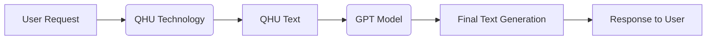
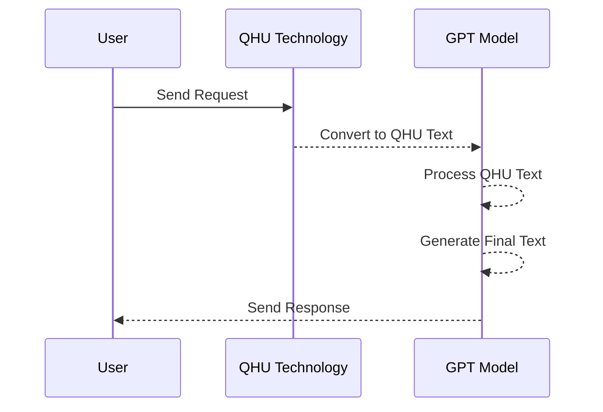
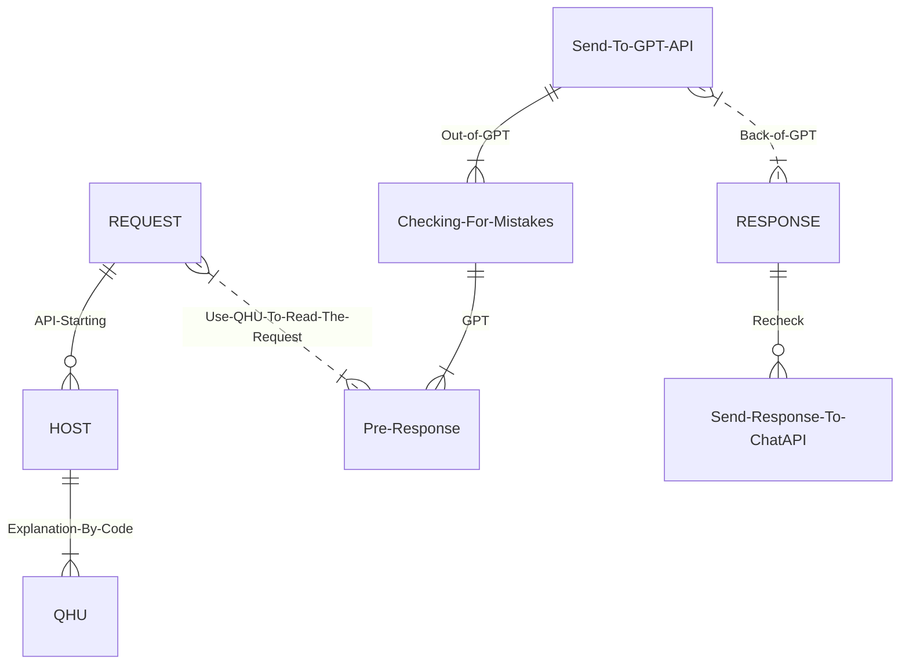

  <h1> Hey! I'm a programmer</h1>
  <h3> My favorite programming languages are:</h3>
  

  
# Working on:
  
## QHU-GPT (Quick Human Understanding - Generative Pretrained Transformer)
QHU-GPT is a language model that combines QHU (Quick Human Understanding) technology with GPT (Generative Pretrained Transformer) to process and generate text based on user requests.
### Request Processing Workflow
The following Mermaid code illustrates the workflow of QHU-GPT:

### Processing Time
The processing time for the entire QHU-GPT process usually ranges from 5 to 60 seconds, depending on the complexity of the request and the length of the generated response.
In this consolidated format, both Mermaid codes are included in a single piece of code. The first code presents a flowchart representation of the process, while the second code illustrates the sequence of interactions between the user, QHU technology, and the GPT model. The processing time information is also provided at the end. I apologize for any confusion caused earlier and I hope this meets your requirements.
### How QHU reads the text?

